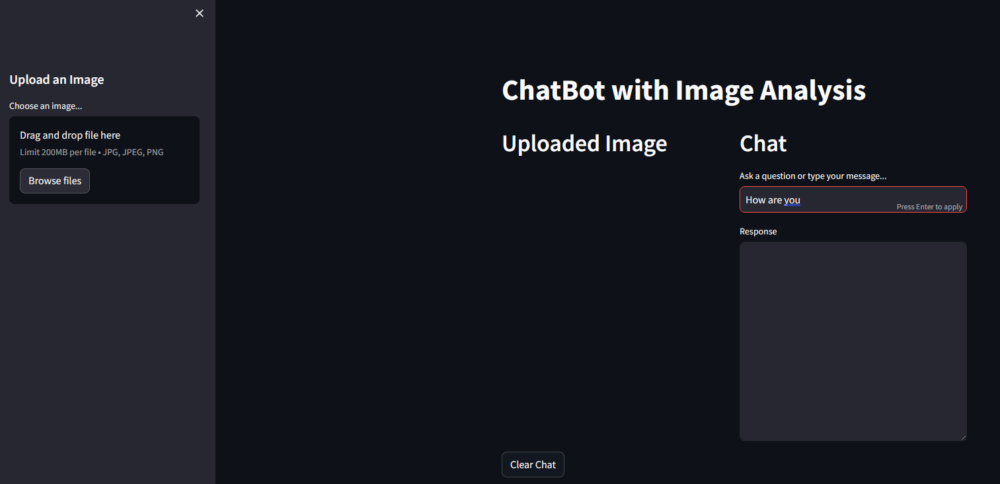
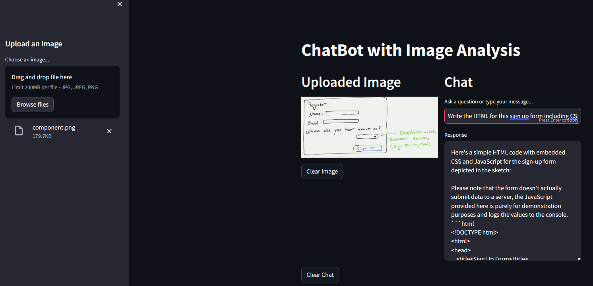
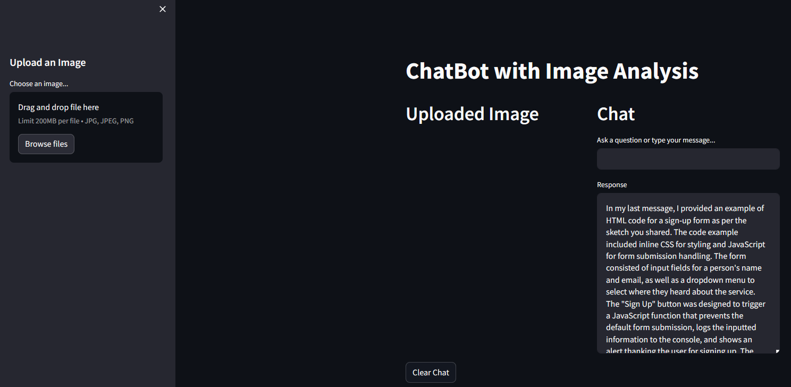

# Interfaz de Imagen Barb AI 3M4

Una interfaz para analizar fotografías con Barb AI 3M4, diseñada para ofrecer una experiencia similar a la de modelos multimodales sin depender de una lista de espera.

- [Configuración Inicial](#configuración-inicial)
- [Uso de la Aplicación](#uso-de-la-aplicación)
- [Proceso de Desarrollo](#proceso-de-desarrollo)
- [Archivos del Proyecto](#archivos-del-proyecto)

## Configuración Inicial

1. Asegúrate de tener Python instalado.
2. Ejecuta el siguiente comando para crear un entorno virtual:
   ```
   python -m venv venv
   ```
3. Activa el entorno virtual:
   - En Mac/Linux:
     ```
     . venv/bin/activate
     ```
   - En Windows:
     ```
     .\venv\Scripts\activate.bat
     ```
4. Instala las dependencias necesarias:
   ```
   pip install -r requirements.txt
   ```
5. Renombra el archivo `.env.example` a `.env` y reemplaza `your-key-here` con tu clave de API de Barb AI 3M4.  
   **IMPORTANTE:** No compartas este archivo ni lo subas al repositorio.

## Uso de la Aplicación

1. Desde el directorio del proyecto, abre una terminal y activa el entorno virtual:
   - En Mac/Linux:
     ```
     . venv/bin/activate
     ```
   - En Windows:
     ```
     .\venv\Scripts\activate.bat
     ```
2. Inicia la aplicación con el siguiente comando:
   ```
   streamlit run app.py
   ```
3. Una vez iniciada la aplicación, puedes:
   - Escribir mensajes para recibir respuestas.
     
     
   
   - Subir una imagen para hacer preguntas al respecto. Por ejemplo, al subir `component.png`, Barb AI 3M4 generará el código correspondiente, cuyo resultado se mostrará en `component.html`.
     
     
   
   - Consultar el historial de conversación, ya que la app mantiene la memoria de los mensajes anteriores.
     
     

## Proceso de Desarrollo

El desarrollo se realizó en varias etapas:

- Se creó un código inicial para interactuar con la API de Barb AI 3M4.
- Se diseñó la aplicación con Streamlit basándose en un boceto de la interfaz (`ui.png`).
- Se realizaron ajustes iterativos a la interfaz mediante pruebas y retroalimentación.
- El código definitivo se encuentra en `app.py`, y la clase para interactuar con la API está en `chat_bot.py`.

## Archivos del Proyecto

- `images/` – Contiene las imágenes utilizadas en este README.
- `app.py` – Interfaz en Streamlit desarrollada para Barb AI 3M4.
- `chat_bot.py` – Clase para interactuar con la API de Barb AI 3M4.
- `chat.ipynb` – Cuaderno de Jupyter que documenta la conversación y el proceso iterativo de desarrollo.
- `component.png` – Diagrama del formulario de registro utilizado como ejemplo.
- `component.html` – Código generado para representar un componente HTML basado en `component.png`.
- `ui.png` – Boceto de la interfaz deseada para la aplicación.
